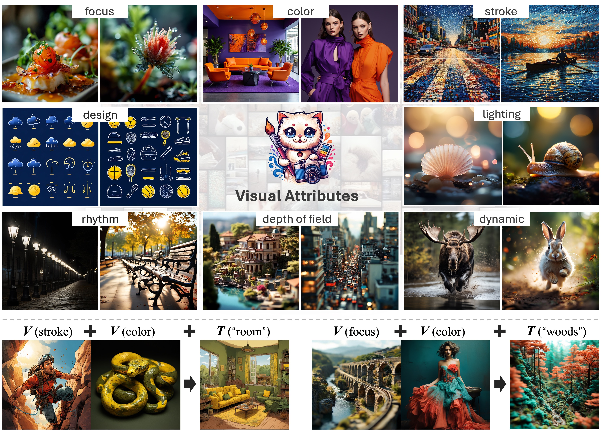
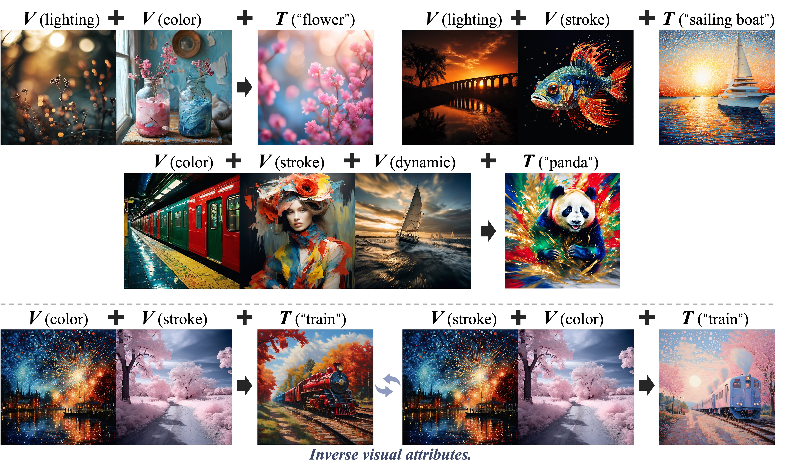

# FiVA: Fine-grained Visual Attributes for T2I Models

[**Project page**](https://fiva-dataset.github.io/) | [**Paper**]() | [**Data**](https://huggingface.co/datasets/FiVA/FiVA)


[Tong Wu](https://wutong16.github.io/),
[Yinghao Xu](https://justimyhxu.github.io/),
[Ryan Po](https://ryanpo.com/),
[Mengchen Zhang](https://kszpxxzmc.github.io/),
[Guandao Yang](https://www.guandaoyang.com/),
[Jiaqi Wang](https://myownskyw7.github.io/),
[Ziwei Liu](https://liuziwei7.github.io/), 
[Dahua Lin️](http://dahua.me/),
[Gordon Wetzstein](https://stanford.edu/~gordonwz/)


<p align="center">
<a href="">"></a>
<a href="https://fiva-dataset.github.io/"></a>
<a href="https://huggingface.co/datasets/FiVA/FiVA"></a>
<a href="" target='_blank'>
</a>
</p>

## Introduction

**TL;DR:** We constructed a fine-grained visual attributes dataset and a framework that 
decouples different visual attributes from source images and adapts them during text-to-image generation.



## Examples
Our model can incorporate different attributes from multiple reference images **V(image, attr_name)** and integrate them into the target subject **T(subject)**, 
while also being capable of extracting various visual attributes from the same reference image based on distinct attribute names.


## Release
🚀 Our code and pretrained models will be released in Mid December. 


## Citation
If you find our dataset or model useful for your research and applications, please cite using this BibTeX:
```bibtex
@inproceedings{wu2024fiva,
      title={Fi{VA}: Fine-grained Visual Attribute Dataset for Text-to-Image Diffusion Models},
      author={Tong Wu and Yinghao Xu and Ryan Po and Mengchen Zhang and Guandao Yang and Jiaqi Wang and Ziwei Liu and Dahua Lin and Gordon Wetzstein},
      booktitle={The Thirty-eight Conference on Neural Information Processing Systems Datasets and Benchmarks Track},
      year={2024},
      url={https://openreview.net/forum?id=Vp6HAjrdIg}
      }
```
